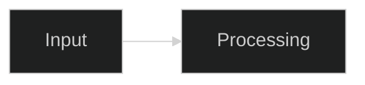

# Contributing to estructura

Guide to the development workflow, testing, documentation standards, and
commit conventions for the estructura POC project.

<br><br>

## Project Overview

estructura is a Python POC environment for validating image-aware document
transcription and annotation workflows. It proves out pipeline design before
porting to KVision (Java/Spring Boot).

```text
estructura/
  src/estructura-java/
    src/main/java/.../docling/    Java CLI and subprocess orchestration
    src/main/resources/scripts/   Python pipeline (run_docling.py)
  docs/                           Output contract, runner protocol, samples
  fixtures/                       Test documents and image catalog
  scripts/                        Download and utility scripts
```

**Key files:**

- `src/estructura-java/src/main/resources/scripts/run_docling.py` -- main
  pipeline script (Docling extraction + image capture + annotation)
- `src/estructura-java/src/main/java/.../DoclingCli.java` -- Java CLI entry point
- `src/estructura-java/src/main/java/.../DoclingRunner.java` -- subprocess
  orchestration (Java calls Python)
- `docs/output-contract.md` -- output format contract (image anchors, stable
  IDs, manifest)
- `docs/runner-protocol.md` -- protocol between Java CLI and Python runner
- `fixtures/image-catalog.md` -- master catalog of all images across the
  evaluation fixture set

<br><br>

## Development Environment

All development and testing use Docker Compose. Do not run Maven or Python
directly on the host machine.

### Start the dev container

```bash
docker compose build dev
docker compose up -d dev
docker compose exec dev bash
```

The dev container includes Java 21, Maven, Python 3, Docling, Tesseract,
Pillow, and `google-genai` pre-installed.

### API keys

Copy `.env.example` to `.env` and set `GOOGLE_API_KEY` with a valid Google AI
Studio API key. The `.env` file is gitignored.

<br><br>

## Testing

### Java unit tests

Run inside the dev container:

```bash
cd src/estructura-java && mvn test
```

Tests use a fake Python runner -- no Docling installation needed.

### Python pipeline smoke test

Run inside the dev container:

```bash
# Basic extraction (no annotation)
python3 src/estructura-java/src/main/resources/scripts/run_docling.py \
    fixtures/downloaded/gemini3_pro_model_card.pdf \
    out/test --image-capture --progress

# With annotation (requires GOOGLE_API_KEY in .env)
python3 src/estructura-java/src/main/resources/scripts/run_docling.py \
    fixtures/downloaded/gemini3_pro_model_card.pdf \
    out/test --image-capture --annotate --progress
```

<br><br>

## Documentation Standards

All files under `docs/` and `fixtures/` follow consistent conventions adapted
from KVision's documentation standards.

### Voice and formatting

- Active voice, imperative mood for instructions
- H1 for title, H2 for sections, H3 for subsections
- `<br><br>` spacing between major sections (no horizontal rules `---`)
- No vague qualifiers ("very", "really", "quite", "fairly", "easily")

### Code blocks

Use language-tagged fenced code blocks. Never use bare (untagged) blocks.

Supported tags: `bash`, `java`, `python`, `json`, `yaml`, `text`, `markdown`,
`mermaid`.

### Inline code

Use backticks for all technical references:

- Class names: `DoclingCli`, `DoclingRunner`
- File paths: `docs/output-contract.md`, `fixtures/image-catalog.md`
- Property names: `GOOGLE_API_KEY`, `--image-capture`
- Commands: `docker compose exec dev bash`, `mvn test`
- Literal values: `true`, `null`, `SHA256`

### Tables

Use markdown tables for structured comparisons. Backtick all property names,
values, and code references within table cells.

### Visual aids

Use Mermaid diagrams for architecture, flows, and state transitions:

````text
<div align="center">



<p><em>Figure N -- Caption text</em></p>
</div>
````

### File naming

All documentation and fixture filenames use **lowercase-hyphen** (kebab-case):

```text
Good:  output-contract.md, runner-protocol.md, image-catalog.md
Bad:   OutputContract.md, runner_protocol.md, ImageCatalog.md
```

### Cross-references

Use relative markdown links with descriptive text:

```markdown
See [Output Contract](./docs/output-contract.md) for image anchor format.
```

<br><br>

## Commit Messages

Use exactly one prefix (`feat:`, `fix:`, `refactor:`, `perf:`, `test:`,
`docs:`, `style:`, `build:`, `chore:`, `wip:`), imperative mood, and keep
subject lines at 72 characters or fewer. Focus on one logical change per commit
and explain WHY in the body.

### Prefix table

| Prefix      | When to use                                 |
|-------------|---------------------------------------------|
| `feat:`     | New user-facing functionality                |
| `fix:`      | Corrects broken behavior                     |
| `refactor:` | Restructures code without changing behavior  |
| `perf:`     | Improves performance measurably              |
| `test:`     | Adds or modifies tests only                  |
| `docs:`     | Documentation changes only                   |
| `style:`    | Formatting/linting only                      |
| `build:`    | Build system, CI, or packaging               |
| `chore:`    | Repo maintenance (deps, configs, cleanup)    |
| `wip:`      | Incomplete work (squash before merge)        |

### Message structure

```text
<prefix> <imperative verb> <what changed>

<WHY this change was needed -- not HOW>
<wrap lines at 72 characters>
```

<br><br>

## Questions or Issues?

Review existing issues on GitHub or open a new issue with detailed reproduction
steps.
