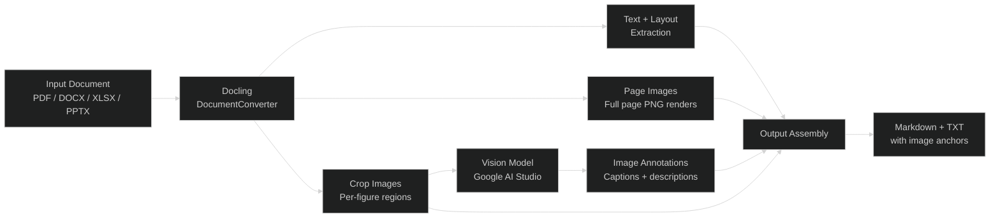

# estructura


Extract, annotate, and transcribe images embedded in PDF, DOCX, XLSX, and PPTX
documents using [Docling](https://github.com/docling-ai/docling) and vision
language models.

estructura combines IBM's Docling document converter with Google AI Studio
vision models to produce image-aware Markdown and plain text transcriptions.
Documents go in, annotated text with stable image references comes out. The
pipeline handles page rendering, region cropping, vision model annotation
(rate-limited, cached, concurrent), and output assembly into formats suitable
for RAG ingestion.

This project serves as the R&D validation environment for
[KVision](https://github.com/konsilix/kvision), proving pipeline design
decisions before production implementation.

<br><br>

## Pipeline Architecture

<div align="center">



<p><em>Figure 1 -- Pipeline from input document to annotated output</em></p>
</div>

<br><br>

## Sample Output

The pipeline produces Markdown with image anchors interleaved at the positions
where figures appear in the source document:

```markdown
## 2. Land Use Analysis

Current land use breaks down as follows: 62% agricultural (primarily
row crops), 24% grassland, 8% forested riparian corridor, and 6%
existing impervious surface from the former industrial facility.


*[Aerial photo showing land cover classification across the 240-hectare site]*


*[Side-by-side comparison of 2020 baseline vs 2027 projected land cover]*

The aerial comparison above shows land cover in 2020 versus the
projected 2027 post-development state. Impervious surface increases
from 6% to 34%, offset by the permanent conservation of the riparian
buffer and a 12-hectare stormwater wetland.
```

Each `![img-pXXX-YY]` anchor uses a stable identifier scheme (page number +
region index) so downstream consumers can reference images predictably. See
[full sample outputs](./docs/samples/) for complete examples in both Markdown
and TXT formats.

<br><br>

## Key Features

- **Image-aware extraction** -- full page renders and per-figure crop images
  with stable identifiers (`img-p001-01`, `img-p002-03`)
- **Vision model annotation** -- cropped images sent to Google AI Studio for
  captions, with SHA256-based caching and concurrent execution
- **Dual output formats** -- Markdown with image anchors and plain text, both
  suitable for RAG pipeline ingestion
- **Java/Python orchestration** -- Java CLI drives a Python pipeline via
  subprocess with a structured JSON event protocol
- **Evaluation framework** -- 3-dimension annotation quality rubric, 31-document
  fixture set, and per-image ground truth methodology

<br><br>

## Quick Start

```bash
# Clone and build the dev container
git clone https://github.com/konsilix/estructura.git
cd estructura
docker compose build dev
docker compose up -d dev

# Run the pipeline against a sample document
docker compose exec dev python3 \
    src/estructura-java/src/main/resources/scripts/run_docling.py \
    fixtures/downloaded/text-heavy/00_gemini3_pro_model_card.pdf \
    out/test --image-capture --progress

# Inspect the output
docker compose exec dev ls out/test/
# 00_gemini3_pro_model_card.md   (annotated Markdown)
# 00_gemini3_pro_model_card.txt  (plain text)
# images/                        (page renders + crop images)
# manifest.json                  (image metadata)
```

To enable vision model annotation, add a Google AI Studio API key (see
[API key setup](#api-key-setup) below) and pass `--annotate`:

```bash
docker compose exec dev python3 \
    src/estructura-java/src/main/resources/scripts/run_docling.py \
    fixtures/downloaded/text-heavy/00_gemini3_pro_model_card.pdf \
    out/test --image-capture --annotate --progress
```

<br><br>

## Development

This section covers everything needed to run the pipeline, execute tests, and
work with the evaluation framework.

### Docker Compose setup

All development uses Docker Compose. The `dev` service builds an image with
Java 21, Maven, Python 3, Docling, Tesseract, Pillow, and the Google AI
annotation client pre-installed.

```bash
docker compose build dev
docker compose up -d dev
docker compose exec dev bash    # interactive shell
```

### Fixture download

Test documents are not committed to the repository. Download them with:

```bash
# Full set (31 fixtures, ~105 MB)
./scripts/download-fixtures.sh

# Quick subset for smoke testing
./scripts/download-fixtures.sh --quick
```

Fixtures are organized by category in `fixtures/downloaded/`:

| Category | Documents | Description |
|----------|-----------|-------------|
| `multi-image/` | 02, 05, 06, 11, 12, 16, 20-28 | Documents with photos, charts, or embedded images |
| `vector-heavy/` | 01, 04 | Figures drawn with vector graphics |
| `text-heavy/` | 00, 03, 17 | Mostly prose, few or no images |
| `scanned/` | 07, 08, 09, 30 | Scanned documents (image-only or OCR'd) |
| `text-only/` | 10 | No images at all |
| `table-image/` | 13, 14, 15, 29 | Standalone image files |

See [fixtures/README.md](./fixtures/README.md) for the full inventory.

### API key setup

Copy `.env.example` to `.env` and set `GOOGLE_API_KEY` with a
[Google AI Studio](https://aistudio.google.com/) API key:

```bash
cp .env.example .env
# Edit .env and add your key
```

Without a key, the pipeline runs extraction and image capture normally --
annotation is skipped. This means you can test the full extraction pipeline
without any API credentials.

### Run modes

Use `-Ddoc.mode` to select a preset when running through the Java CLI:

| Mode | Docling | OCR | Tables | Annotations |
|------|---------|-----|--------|-------------|
| (default) | on | on | off | off |
| `docling-only` | on | off | on | off |
| `ocr-only` | off | on | off | off |
| `tables` | on | on | on | off |
| `annotations` | on | on | on | on |

```bash
# Java CLI with a mode preset
docker compose exec dev bash -c \
    "cd src/estructura-java && mvn exec:java -Ddoc.input=/workspace/fixtures/downloaded/text-heavy/00_gemini3_pro_model_card.pdf -Ddoc.mode=annotations"
```

For fine-grained control, individual properties are available:

| Property | Type | Default | Description |
|----------|------|---------|-------------|
| `doc.input` | string | (required) | File path or URL to process |
| `doc.out` | string | `out` | Output directory |
| `doc.mode` | string | (none) | Preset mode (see table above) |
| `doc.imageCapture` | boolean | `false` | Enable page image capture and crop extraction |
| `doc.imageAnnotations` | boolean | `false` | Enable vision model annotation |
| `doc.ocr` | boolean | `true` | Enable/disable OCR stage |
| `doc.tableStructure` | boolean | `false` | Enable table structure extraction |
| `doc.progress` | boolean | `false` | Show per-page timing |
| `doc.maxPages` | integer | (none) | Limit pages to process |
| `doc.dpi` | integer | `120` | OCR resolution |

### Inspecting output

Output files land in the directory specified by `doc.out` (default: `out/`):

```text
out/test/
  00_gemini3_pro_model_card.md     Markdown with image anchors
  00_gemini3_pro_model_card.txt    Plain text with image anchors
  images/
    pages/                         Full page renders (p001.png, p002.png, ...)
    crops/                         Per-figure crops (p001-01.png, p002-03.png, ...)
  manifest.json                    Image metadata (paths, dimensions, annotations)
```

Image anchors in the Markdown follow the pattern ``
where `pXXX` is the zero-padded page number and `YY` is the region index on
that page. See [Output Contract](./docs/output-contract.md) for the full
specification.

### Running tests

Java unit tests use a fake Python runner, so no Docling installation is needed:

```bash
docker compose exec dev bash -c "cd /workspace/src/estructura-java && mvn test"
```

The fake runner validates the JSON event protocol between `DoclingRunner` and
`run_docling.py` without requiring actual document processing. For end-to-end
pipeline testing, run the Python script directly against downloaded fixtures.

### Prerequisites (host install)

If you prefer running outside Docker:

- Java 21+
- Maven 3.9+
- Python 3.10+ with dependencies: `pip install -r requirements.txt`
- Tesseract OCR

<br><br>

## Documentation

| Category | File | Description |
|----------|------|-------------|
| Architecture | [output-contract.md](./docs/output-contract.md) | Image anchor format, stable IDs, manifest schema |
| Architecture | [runner-protocol.md](./docs/runner-protocol.md) | JSON event protocol between Java CLI and Python runner |
| Evaluation | [annotation-rubric.md](./docs/evaluation/annotation-rubric.md) | 3-dimension scoring rubric for annotation quality |
| Evaluation | [evaluation/README.md](./docs/evaluation/README.md) | Two-pass evaluation methodology overview |
| Reference | [image-catalog.md](./docs/image-catalog.md) | Master catalog of images across 31 evaluation fixtures |
| Samples | [docs/samples/](./docs/samples/) | Example Markdown and TXT outputs with and without images |
| Standards | [docs/standards/](./docs/standards/) | Commit messages, documentation, and engineering conventions |

<br><br>

## Project Structure

```text
estructura/
  README.md
  LICENSE
  requirements.txt                          Python dependencies
  docker-compose.yml
  scripts/
    download-fixtures.sh                    Fetch test documents
    compare-quality.py                      Annotation quality comparison
  src/estructura-java/
    pom.xml
    src/
      main/
        java/com/estructura/docling/
          DoclingCli.java                   CLI entry point
          DoclingRunner.java                Subprocess orchestration
          DoclingRunnerOptions.java         Configuration record
          DoclingResult.java                Structured output record
          DoclingMetrics.java               Metrics from Python runner
          DoclingRunnerException.java
        resources/scripts/
          run_docling.py                    Python pipeline (Docling + OCR + annotation)
      test/
        java/com/estructura/docling/
          DoclingRunnerTest.java            Unit tests (fake runner, no Docling needed)
        resources/scripts/
          fake_docling_runner.py            Test fake
  docs/
    output-contract.md                      Image anchor format specification
    runner-protocol.md                      JSON event protocol specification
    image-catalog.md                        Master image catalog
    evaluation/                             Rubric, test sets, ground truth
    samples/                                Example pipeline outputs
    standards/                              Commit, documentation, engineering conventions
  fixtures/
    downloaded/                             Test documents (gitignored, fetched via script)
    eval-subset/                            Evaluation image crops by difficulty
```

<br><br>

## License

[MIT](./LICENSE)
