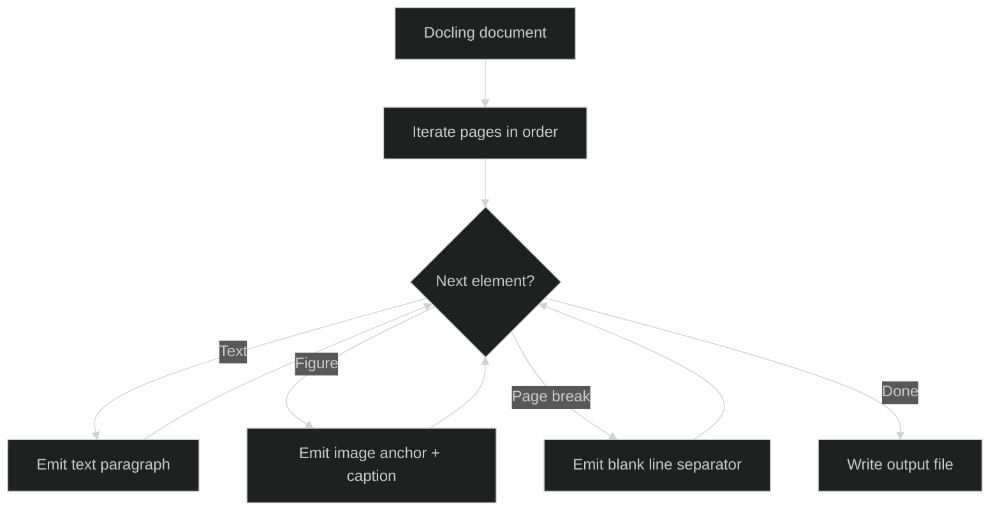

# Image-Aware Output Contract

This document defines how image-aware Markdown and TXT outputs represent
extracted images alongside document text. The pipeline produces a single
text artifact per run (`<stem>.md` or `<stem>.txt`) with image anchors
interleaved at the positions where figures appear in the source document.

All implementations (Python POC and Java KVision port) must conform to
this contract so downstream consumers can rely on stable identifiers,
predictable ordering, and consistent anchor syntax.

<br><br>

## Stable Image Identifier Scheme

Every extracted image receives a deterministic ID derived from its page
number and sequence position on that page.

**Format:** `img-p{page}-{seq}`

- `{page}` -- 3-digit zero-padded page number (001-999)
- `{seq}` -- 2-digit zero-padded sequence within the page (01-99)

| Component | Width | Range | Example |
|-----------|-------|-------|---------|
| Page number | 3 digits | 001--999 | `p001`, `p012`, `p100` |
| Sequence | 2 digits | 01--99 | `01`, `05`, `20` |

**Examples:**

| ID | Meaning |
|----|---------|
| `img-p001-01` | First image on page 1 |
| `img-p001-02` | Second image on page 1 |
| `img-p003-01` | First image on page 3 |
| `img-p012-05` | Fifth image on page 12 |

The ID is stable across re-runs of the same document. Sequence numbers
reset to `01` on each new page.

<br><br>

## Directory Layout

When image capture is enabled, the output directory contains:

```text
out/
  <stem>.md                        # or <stem>.txt
  images/
    pages/
      page_001.png                 # full-page render
      page_002.png
    crops/
      p001-01.png                  # cropped image regions
      p001-02.png
      p003-01.png
    manifest.txt                   # metadata index
```

- **Page images** use the pattern `page_{page}.png` (3-digit zero-padded).
- **Crop files** use `p{page}-{seq}.png`, matching the numeric portion of
  the stable ID. The crop path relative to the output directory is
  `images/crops/p{page}-{seq}.png`.

<br><br>

## Markdown Anchor Format

In `--output markdown` mode, each image appears as a standard Markdown
image element followed by its caption on the next line.

**Anchor syntax:**

```markdown

```

**Caption placement:** The caption appears on the line immediately after
the anchor, formatted as italic text.

```markdown

*Chart showing quarterly revenue growth across all regions.*
```

**Full example with surrounding text:**

```markdown
## Financial Overview

The following chart summarizes Q3 performance across all divisions.


*Chart showing quarterly revenue growth across all regions.*

Revenue increased 12% year-over-year, driven primarily by the
enterprise segment.


*Breakdown of revenue by business segment.*

The enterprise segment accounted for 68% of total revenue.
```

<br><br>

## TXT Anchor Format

In `--output text` mode, each image appears as a bracketed marker with
the image ID and crop path, followed by its caption on the next line.

**Anchor syntax:**

```text
[IMAGE: img-p{page}-{seq} | images/crops/p{page}-{seq}.png]
```

**Caption placement:** The caption appears on the line immediately after
the anchor, indented with two spaces.

```text
[IMAGE: img-p001-01 | images/crops/p001-01.png]
  Chart showing quarterly revenue growth across all regions.
```

**Full example with surrounding text:**

```text
Financial Overview

The following chart summarizes Q3 performance across all divisions.

[IMAGE: img-p002-01 | images/crops/p002-01.png]
  Chart showing quarterly revenue growth across all regions.

Revenue increased 12% year-over-year, driven primarily by the
enterprise segment.

[IMAGE: img-p002-02 | images/crops/p002-02.png]
  Breakdown of revenue by business segment.

The enterprise segment accounted for 68% of total revenue.
```

<br><br>

## Ordering Rules

Image anchors appear in **document reading order** following these rules:

1. **Page boundaries define primary order.** All content from page N
   appears before any content from page N+1. Pages are numbered starting
   at 1.

2. **Within a page, elements follow reading order.** Text paragraphs and
   image anchors appear in the order Docling reports them (top-to-bottom,
   left-to-right for LTR documents).

3. **Images insert at their document position.** An image anchor appears
   between the text paragraphs that precede and follow the figure in the
   source layout. The anchor does not float to the top or bottom of the
   page.

4. **Consecutive images stay in sequence.** When multiple figures appear
   adjacent in the source (no intervening text), their anchors appear in
   sequence order without extra blank lines between them.

5. **Page transitions insert a blank line.** When text or images from a
   new page begin, one blank line separates the last element of the
   previous page from the first element of the new page.

<div align="center">



</div>

**Figure 1:** Output assembly iterates document elements in reading order, emitting text paragraphs and image anchors at their source positions.

<br><br>

## Caption Placement

Captions appear on the line immediately following their image anchor. The
pipeline supports three caption sources:

| Source | When used | Example |
|--------|-----------|---------|
| Vision model | Annotation enabled and succeeds | `Chart showing quarterly revenue growth.` |
| Placeholder stub | Annotation enabled but using stub | `[Placeholder: figure on page 2, region 1]` |
| No caption | Annotation disabled or failed | `[No caption available]` |

**Rules:**

- Every image anchor has exactly one caption line. There is no "caption-less"
  anchor -- if no caption is available, the placeholder `[No caption available]`
  is used.
- The caption follows the anchor on the next line with no blank line between
  them.
- In Markdown, the caption wraps in `*italic*`. In TXT, the caption indents
  with two spaces.

<br><br>

## Edge Cases

| Scenario | Output file | `images/` directory | Manifest |
|----------|-------------|---------------------|----------|
| Text-only document | Text paragraphs only | Not created | Not created |
| Empty document | Empty (zero bytes) | Not created | Not created |
| Image with no caption | Anchor + `[No caption available]` | Created with crops | Lists all images |
| Page with only images | Sequential anchors, no text between | Created with crops | Lists all images |
| Failed crop extraction | Anchor with failure marker | Created (crop file missing) | Lists image (file absent) |
| Image capture disabled | Text paragraphs only | Not created | Not created |

<br><br>

### Text-only document (no figures detected)

The output contains only text paragraphs. No image anchors appear, and
the pipeline does not create an `images/` directory or manifest. The
output is identical to a non-image-aware run.

See `docs/samples/sample-textonly.md` and `docs/samples/sample-textonly.txt`
for complete examples.

### Empty document (no text, no images)

The output file is empty (zero bytes). No `images/` directory is created.
The pipeline still completes successfully and reports `"status": "ok"` in
the JSON status line.

### Image with no caption

When annotation is disabled or the vision model fails for a specific
image, the pipeline uses the placeholder `[No caption available]`.

**Markdown:**

```markdown

*[No caption available]*
```

**TXT:**

```text
[IMAGE: img-p002-01 | images/crops/p002-01.png]
  [No caption available]
```

The crop file still exists on disk. Only the caption is missing. The
placeholder distinguishes this case from a failed crop extraction, where
the anchor itself carries the failure marker.

### Page with only images (no text between anchors)

Image anchors appear in sequence with no intervening text. Each anchor
still has its caption line. A blank line separates consecutive anchors.

**Markdown:**

```markdown

*Satellite view of the proposed construction site.*


*Elevation diagram showing planned building heights.*


*Floor plan for the ground level.*
```

**TXT:**

```text
[IMAGE: img-p005-01 | images/crops/p005-01.png]
  Satellite view of the proposed construction site.

[IMAGE: img-p005-02 | images/crops/p005-02.png]
  Elevation diagram showing planned building heights.

[IMAGE: img-p005-03 | images/crops/p005-03.png]
  Floor plan for the ground level.
```

### Image with failed crop extraction

When a crop cannot be extracted (corrupted region, invalid bounding box),
the anchor uses a failure marker instead of a path.

**Markdown:**

```markdown

*[IMAGE: img-p003-02 | extraction failed]*
```

**TXT:**

```text
[IMAGE: img-p003-02 | extraction failed]
  [No caption available]
```

The anchor still uses the stable ID so consumers can identify which image
failed. The crop file does not exist on disk. The manifest still lists
the image entry with its bounding box.

### Image capture disabled

When image capture is not enabled, the output contains only text -- no
anchors, no `images/` directory, no manifest. Behavior is identical to
the text-only document case.

<br><br>

## Manifest Format

The manifest at `images/manifest.txt` indexes all extracted images. Each
line describes one crop. The pipeline writes this file after crop
extraction completes.

**Format:**

```text
# id | page | bbox_left,bbox_top,bbox_right,bbox_bottom | crop_path
img-p001-01 | 1 | 72.0,145.3,540.0,380.7 | images/crops/p001-01.png
img-p001-02 | 1 | 72.0,420.0,540.0,600.5 | images/crops/p001-02.png
img-p003-01 | 3 | 100.0,50.0,500.0,300.0 | images/crops/p003-01.png
```

| Field | Description |
|-------|-------------|
| `id` | Stable image ID (`img-p{page}-{seq}`) |
| `page` | 1-based page number (unpadded integer) |
| `bbox` | Bounding box in document coordinates (left, top, right, bottom) |
| `crop_path` | Path to the crop file relative to the output directory |

Failed crops still appear in the manifest with their bounding box, but
the crop file does not exist on disk.

<br><br>

## Summary of Format Differences

| Aspect | Markdown | TXT |
|--------|----------|-----|
| Anchor | `` | `[IMAGE: id \| path]` |
| Caption style | `*caption text*` (italic) | Two-space indent |
| No-caption placeholder | `*[No caption available]*` | `  [No caption available]` |
| Failure marker | `*[IMAGE: id \| extraction failed]*` | `  [No caption available]` + failure in anchor |
| File extension | `.md` | `.txt` |
