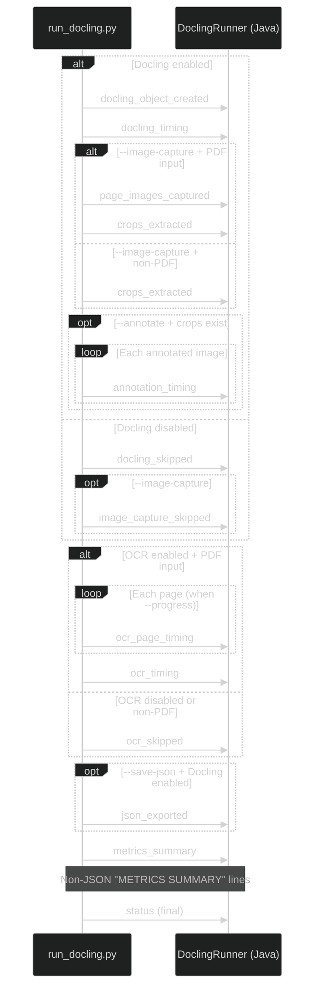

# Runner Stdout Event Protocol

This document defines the JSON event protocol that `run_docling.py` emits on
stdout. Java's `DoclingRunner.parseResult()` reads these events line-by-line to
build a `DoclingResult` object with associated `DoclingMetrics`.

Every JSON event occupies a single line. Non-JSON lines (human-readable
summaries, log messages) are also emitted and should be silently skipped by
parsers. The final event is always the **status** object, which signals pipeline
completion.

<br><br>

## Event Emission Order

The runner emits events in a fixed order. Some events are conditional on flags
or input type.

<div align="center">



</div>

**Figure 1:** Event emission sequence showing conditional branches for Docling,
image capture, OCR, and the final status. Java parses all lines and extracts
only the JSON events it recognizes.

<br><br>

## Event Reference

Each subsection documents one event type with its fields, when it is emitted,
and a concrete example.

<br><br>

### `docling_object_created`

Emitted after the Docling `DocumentConverter` is instantiated and the library
version is known. Always emitted when Docling is enabled (`--docling`, which is
the default).

| Field | Type | Description |
|-------|------|-------------|
| `event` | string | Always `"docling_object_created"` |
| `docling_version` | string | Docling library version (e.g., `"2.31.1"`) |

```json
{"event": "docling_object_created", "docling_version": "2.31.1"}
```

**Java parser action:** Sets `doclingCreated = true` and captures
`doclingVersion`. Used to verify Docling initialized successfully.

<br><br>

### `docling_timing`

Emitted after Docling conversion completes (includes document parsing, table
structure analysis, and page image generation if enabled).

| Field | Type | Description |
|-------|------|-------------|
| `event` | string | Always `"docling_timing"` |
| `seconds` | number | Wall-clock time for the entire Docling stage |

```json
{"event": "docling_timing", "seconds": 4.231}
```

**Java parser action:** Currently not consumed by `parseResult()`. Available in
raw output lines for debugging.

<br><br>

### `docling_skipped`

Emitted when Docling is disabled via `--no-docling`.

| Field | Type | Description |
|-------|------|-------------|
| `event` | string | Always `"docling_skipped"` |

```json
{"event": "docling_skipped"}
```

**Java parser action:** Not explicitly consumed. When Docling is disabled,
`parseResult()` skips the `doclingCreated` validation check.

<br><br>

### `page_images_captured`

Emitted after page images are saved to `images/pages/`. Only emitted when
`--image-capture` is active and the input is a PDF.

| Field | Type | Description |
|-------|------|-------------|
| `event` | string | Always `"page_images_captured"` |
| `count` | integer | Number of page images saved (0 to `--max-image-pages`) |

```json
{"event": "page_images_captured", "count": 9}
```

Page images are saved as `images/pages/page_{NNN}.png` where `NNN` is the
zero-padded page number (e.g., `page_001.png`).

**Java parser action:** Not currently consumed. Included in raw output for
debugging and future `DoclingMetrics` expansion.

<br><br>

### `crops_extracted`

Emitted after all image crops are extracted from page images using Docling
bounding boxes. Only emitted when `--image-capture` is active and the input is a
PDF.

| Field | Type | Description |
|-------|------|-------------|
| `event` | string | Always `"crops_extracted"` |
| `count` | integer | Number of crops successfully saved |
| `failures` | integer | Number of crop extraction failures |

```json
{"event": "crops_extracted", "count": 12, "failures": 0}
```

Crops are saved as `images/crops/p{PPP}-{SS}.png` where `PPP` is the
zero-padded page number and `SS` is the zero-padded sequence within that page
(e.g., `p001-01.png`). A manifest file is written to `images/manifest.txt`
listing all crops with their IDs, page numbers, bounding boxes, and file paths.

**Java parser action:** Not currently consumed. The `image_capture` section of
`metrics_summary` provides the same data in a structured form.

<br><br>

### `annotation_timing`

Emitted once per image after annotation completes (or fails). Provides per-image
wall-clock latency for performance profiling and cloud-vs-self-hosted comparison.

| Field | Type | Description |
|-------|------|-------------|
| `event` | string | Always `"annotation_timing"` |
| `image_id` | string | Stable image ID (e.g., `"img-p001-01"`) |
| `seconds` | number | Wall-clock time for this annotation call |
| `failed` | boolean | Whether the annotation failed (placeholder used) |

```json
{"event": "annotation_timing", "image_id": "img-p001-01", "seconds": 3.142, "failed": false}
```

Emitted for both PDF and non-PDF annotation paths. The `seconds` field measures
end-to-end latency including network round-trip to Google AI Studio (Gemma mode)
or local stub generation (stub mode).

**Java parser action:** Not currently consumed. Use for latency monitoring and
comparison against self-hosted inference.

<br><br>

### `image_capture_skipped`

Emitted when image capture was requested but cannot proceed because Docling is
disabled. Non-PDF formats no longer trigger this event -- they extract embedded
images via `PictureItem.image` instead.

| Field | Type | Description |
|-------|------|-------------|
| `event` | string | Always `"image_capture_skipped"` |
| `reason` | string | Why capture was skipped: `"docling disabled"` |

```json
{"event": "image_capture_skipped", "reason": "docling disabled"}
```

This event appears only when `--image-capture` is combined with `--no-docling` --
crops require Docling's document model, so image capture is skipped entirely.

**Java parser action:** Not currently consumed.

<br><br>

### `ocr_page_timing`

Emitted once per page during OCR when `--progress` is active. Provides
per-page render and OCR timing for progress tracking.

| Field | Type | Description |
|-------|------|-------------|
| `event` | string | Always `"ocr_page_timing"` |
| `page` | integer | Current page number (1-based) |
| `total_pages` | integer | Total pages in the document |
| `render_seconds` | number | Wall time to render this page to a bitmap |
| `ocr_seconds` | number | Wall time to run Tesseract on this page |

```json
{"event": "ocr_page_timing", "page": 3, "total_pages": 9, "render_seconds": 0.412, "ocr_seconds": 1.023}
```

Only emitted when all three conditions are met:
1. OCR is enabled (default, unless `--no-ocr`)
2. Input is a PDF (OCR is skipped for non-PDF formats)
3. `--progress` flag is set

**Java parser action:** Not currently consumed. Available for progress bar
implementation in the Java layer.

<br><br>

### `ocr_timing`

Emitted after OCR completes for the entire document.

| Field | Type | Description |
|-------|------|-------------|
| `event` | string | Always `"ocr_timing"` |
| `seconds` | number | Total wall-clock time for the OCR stage |

```json
{"event": "ocr_timing", "seconds": 8.547}
```

Only emitted when OCR runs (PDF input + OCR enabled).

**Java parser action:** Not currently consumed. The `ocr` section of
`metrics_summary` provides the same timing.

<br><br>

### `ocr_skipped`

Emitted when OCR does not run.

| Field | Type | Description |
|-------|------|-------------|
| `event` | string | Always `"ocr_skipped"` |
| `reason` | string or absent | Why OCR was skipped: `"non-pdf input"` when the input is not a PDF, or absent when `--no-ocr` was passed |

```json
{"event": "ocr_skipped", "reason": "non-pdf input"}
```

```json
{"event": "ocr_skipped"}
```

**Java parser action:** Not currently consumed.

<br><br>

### `json_exported`

Emitted when `--save-json` is passed and Docling conversion is enabled. The
runner exports the full `DoclingDocument` structure as JSON via
`export_to_dict()` and writes it alongside the Markdown/TXT output.

| Field | Type | Description |
|-------|------|-------------|
| `event` | string | Always `"json_exported"` |
| `path` | string | Absolute path to the exported JSON file |

```json
{"event": "json_exported", "path": "/tmp/out/report.json"}
```

**Java parser action:** Not currently consumed. Provides lossless structural
metadata (bounding boxes, section hierarchy, table cells, figure positions) for
KVision layout-enriched output development.

<br><br>

### `metrics_summary`

The comprehensive metrics event emitted near the end of every run. Contains
nested objects for each pipeline stage.

| Field | Type | Description |
|-------|------|-------------|
| `event` | string | Always `"metrics_summary"` |
| `docling` | object | Docling stage metrics |
| `ocr` | object | OCR stage metrics |
| `options` | object | Configuration flags used for this run |
| `image_capture` | object | Image capture and crop extraction metrics |
| `annotation` | object | Annotation metrics |

#### `docling` object

| Field | Type | Description |
|-------|------|-------------|
| `enabled` | boolean | Whether Docling ran |
| `seconds` | number or null | Docling wall time (null when disabled) |

#### `ocr` object

| Field | Type | Description |
|-------|------|-------------|
| `enabled` | boolean | Whether OCR ran (false for non-PDF or `--no-ocr`) |
| `seconds` | number or null | OCR wall time (null when disabled) |
| `pages` | integer | Number of pages processed (0 when disabled) |
| `dpi` | integer | OCR resolution used |

#### `options` object

| Field | Type | Description |
|-------|------|-------------|
| `table_structure` | boolean | Whether table structure analysis was enabled |
| `image_capture` | boolean | Whether image capture was requested |
| `max_pages` | integer or null | Page limit for OCR (null = unlimited) |
| `max_image_pages` | integer | Max pages for image capture |
| `max_images_per_page` | integer | Max crops per page |
| `max_total_images` | integer | Max total crops |
| `cache_used` | boolean | Whether cache reuse was active |

#### `image_capture` object

| Field | Type | Description |
|-------|------|-------------|
| `enabled` | boolean | Whether image capture actually ran (false for non-PDF) |
| `pages_saved` | integer | Number of page images written |
| `crops_extracted` | integer | Number of successful crops |
| `crop_failures` | integer | Number of failed crop extractions |

#### `annotation` object

| Field | Type | Description |
|-------|------|-------------|
| `enabled` | boolean | Whether annotation was requested (`--annotate` flag) |
| `mode` | string or null | Annotation mode: `"stub"`, `"gemma"`, or null |
| `images_annotated` | integer | Number of successfully annotated images |
| `annotation_failures` | integer | Number of failed annotations (placeholder used) |
| `total_annotation_seconds` | number | Total wall time for all annotations |
| `avg_annotation_seconds` | number or null | Average per-image annotation time (null when no images) |

```json
{
  "event": "metrics_summary",
  "docling": {
    "enabled": true,
    "seconds": 4.231
  },
  "ocr": {
    "enabled": true,
    "seconds": 8.547,
    "pages": 9,
    "dpi": 120
  },
  "options": {
    "table_structure": false,
    "image_capture": true,
    "max_pages": null,
    "max_image_pages": 50,
    "max_images_per_page": 20,
    "max_total_images": 200,
    "cache_used": false
  },
  "image_capture": {
    "enabled": true,
    "pages_saved": 9,
    "crops_extracted": 12,
    "crop_failures": 0
  },
  "annotation": {
    "enabled": true,
    "mode": "gemma",
    "images_annotated": 11,
    "annotation_failures": 1,
    "total_annotation_seconds": 24.312,
    "avg_annotation_seconds": 2.026
  }
}
```

**Java parser action:** Parsed by `parseMetrics()` into a `DoclingMetrics`
record. Currently extracts `docling`, `ocr`, and `options` sections. The
`image_capture` and `annotation` sections are not yet parsed -- these require
adding new nested records to `DoclingMetrics` during the KVision port.

<br><br>

### `status` (final)

The last JSON line emitted on every successful run. Contains the final status
and output file paths. This event does NOT have an `event` field -- it is
identified by the presence of a `status` field.

| Field | Type | Description |
|-------|------|-------------|
| `status` | string | `"ok"` on success, `"error"` on failure |
| `input` | string | Absolute path to the (possibly cached) input file |
| `markdown` | string or null | Absolute path to the Markdown output file, or null |
| `text` | string or null | Absolute path to the TXT output file, or null |
| `json` | string or null | Absolute path to the JSON export file, or null |

Success example:

```json
{
  "status": "ok",
  "input": "/tmp/out/_cache/report.pdf",
  "markdown": "/tmp/out/report.md",
  "text": null,
  "json": null
}
```

Error example (emitted when the runner detects an internal error but does not
crash):

```json
{"status": "error", "message": "forced failure"}
```

**Java parser action:** Primary event consumed by `parseResult()`. Validates
`status == "ok"`, extracts `inputPath`, `markdownPath`, `textPath`, and
`jsonPath` into the `DoclingResult` record.

<br><br>

## Non-JSON Output

Between `metrics_summary` and `status`, the runner emits a human-readable
metrics block. These lines are not JSON and should be skipped by parsers.

```
METRICS SUMMARY
  Docling: 4.23s
  OCR: 8.55s (pages=9, dpi=120)
  Tables: disabled
  Image capture: 9 pages, 12 crops (limits: pages=50, per_page=20, total=200)
  Annotation: 11 annotated, 1 failures, 24.31s total, 2.03s avg (gemma mode)
  Cache reuse: no
```

Logging output (when `--verbose` is set) is written to stderr and does not
appear in stdout.

<br><br>

## Exit Codes

| Code | Meaning |
|------|---------|
| 0 | Success (check `status` event for `"ok"` vs `"error"`) |
| 1 | Fatal error (missing API key, missing input file, unhandled exception) |
| 2 | Missing Python dependencies |

A non-zero exit code means no `status` event was emitted. Java's
`DoclingRunner` throws `DoclingRunnerException` with the captured output.

<br><br>

## Java Parser Coverage

The table below shows which events `DoclingRunner.parseResult()` currently
consumes and which are available for future use.

| Event | Consumed | Java Action |
|-------|----------|-------------|
| `docling_object_created` | Yes | Sets `doclingCreated`, captures `doclingVersion` |
| `docling_timing` | No | Available in raw output |
| `docling_skipped` | No | Implicit (no `doclingCreated` when disabled) |
| `page_images_captured` | No | Available in raw output |
| `crops_extracted` | No | Available in raw output |
| `annotation_timing` | No | Available for latency monitoring |
| `image_capture_skipped` | No | Available in raw output |
| `ocr_page_timing` | No | Available for progress tracking |
| `ocr_timing` | No | Available in raw output |
| `ocr_skipped` | No | Available in raw output |
| `metrics_summary` | Partial | Parses `docling`, `ocr`, `options`; skips `image_capture`, `annotation` |
| `status` | Yes | Validates status, extracts output paths |

To support the image-aware pipeline, the KVision port needs to:

1. Add `ImageCapture` and `Annotation` nested records to `DoclingMetrics`.
2. Parse `image_capture` and `annotation` sections in `parseMetrics()`.
3. Optionally consume `page_images_captured` and `crops_extracted` for
   progress reporting.
4. Pass `--annotate` and `--gemma-model` flags in `buildCommand()`.
