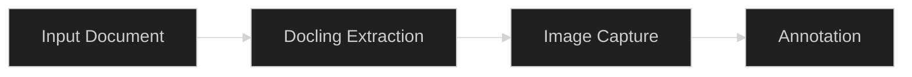

# Documentation Standards

All files under `docs/` and `fixtures/` follow these conventions so
documentation reads consistently across the project and stays aligned with
konsillix standards. When adding or editing docs, match these patterns rather
than inventing new ones.

For development setup and commit conventions, see
[Contributing Guide](../../CONTRIBUTING.md).

<br><br>

## Voice and Perspective

Write in **active voice** with **imperative mood** for instructions:

```text
Good:  "Start the dev container before running the pipeline."
Bad:   "The dev container should be started before the pipeline is run."
```

Address the reader as **"you"**. Avoid first-person collective ("we
recommend"):

```text
Good:  "You can configure the API key via .env."
Bad:   "We provide a configurable API key in .env."
```

<br><br>

## Specificity

Prefer concrete metrics over vague qualifiers:

```text
Good:  "Reduces annotation time from 12s to 4s per image (67% improvement)"
Bad:   "Significantly improves annotation speed"
```

Avoid: "very", "really", "quite", "fairly", "easily", "simply",
"just", "significantly" (without data).

<br><br>

## Formatting

**Heading hierarchy:** Follow `#` -> `##` -> `###` -> `####` strictly. Never
skip a level. Only one `#` (H1) per document.

**Section spacing:** Use `<br><br>` between major sections (H2-level blocks).
Do not use horizontal rules (`---`) for visual separation.

**Code blocks:** Always include a language tag. Never use bare (untagged)
fenced blocks.

````text
```bash
docker compose exec dev python3 run_docling.py input.pdf out/
```

```python
converter = DocumentConverter(pipeline_options=options)
```

```java
DoclingRunner runner = new DoclingRunner(scriptPath);
```

```json
{
  "images": [],
  "manifest": {}
}
```
````

Supported tags: `bash`, `python`, `java`, `json`, `yaml`, `text`, `markdown`,
`mermaid`.

**Inline code:** Use backticks for all technical references:

- Class names: `DoclingCli`, `DoclingRunner`, `DocumentConverter`
- Method names: `convert()`, `annotate_images()`
- File paths: `docs/output-contract.md`, `fixtures/image-catalog.md`
- Environment variables: `GOOGLE_API_KEY`, `DOCKER_BUILDKIT`
- CLI flags and commands: `--image-capture`, `docker compose exec dev bash`
- Literal values: `true`, `null`, `SHA256`, `0`, `"markdown"`
- Property keys: `pipeline_options`, `images_scale`

<br><br>

## Visual Aids

**Mermaid diagrams** -- use for architecture, flows, and state transitions:

````text
<div align="center">



</div>

**Figure 1:** Brief description of what the diagram shows.
````

Rules:

- Always include `%%{init: {'theme':'dark'}}%%` as the first line
- Wrap in `<div align="center">` for centering
- Add a numbered `**Figure N:**` caption immediately after the closing `</div>`

**Tables** -- use for comparing 3+ options, listing configuration, or showing
structured data:

```text
| Flag | Default | Description |
|------|---------|-------------|
| `--image-capture` | off | Extract and save page/crop images |
| `--annotate` | off | Send crops to vision model for captions |
| `--progress` | off | Show progress bar during extraction |
```

Backtick all property names, values, and code references within table cells.

<br><br>

## Cross-References

Use relative markdown links with descriptive text:

```text
See [Output Contract](./output-contract.md) for image anchor format.
```

For longer docs, include a quick-links blockquote near the top:

```text
> **Quick links:** [Output Contract](./output-contract.md) · [Runner Protocol](./runner-protocol.md)
```

Separate links with ` . ` (center dot, `·`). Bold the current page's link
when it appears in a quick-links list.

<br><br>

## File Naming

All documentation and fixture filenames use **lowercase-hyphen** (kebab-case):

```text
Good:  output-contract.md, runner-protocol.md, image-catalog.md
Bad:   OutputContract.md, runner_protocol.md, ImageCatalog.md
```

<br><br>

[Back to Contributing Guide](../../CONTRIBUTING.md)
